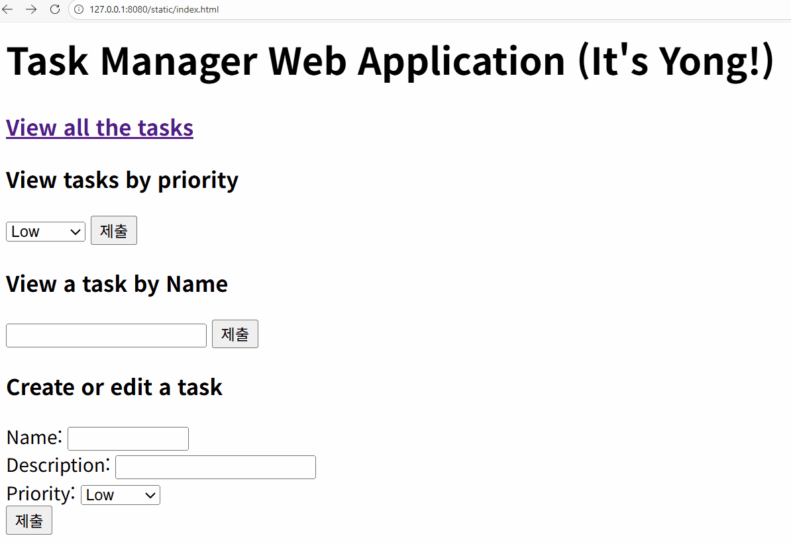
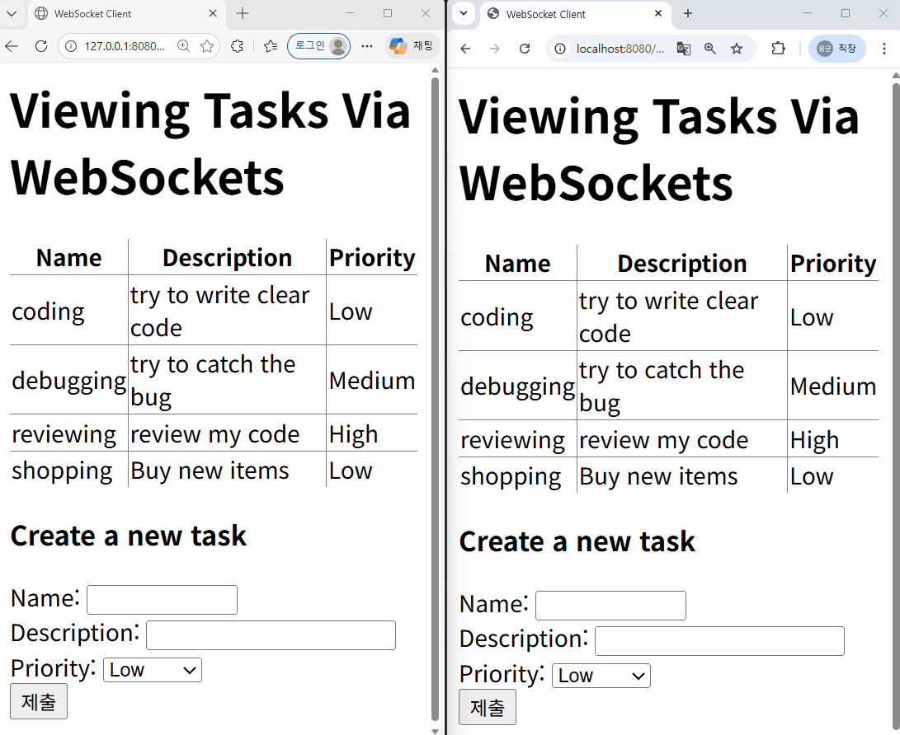
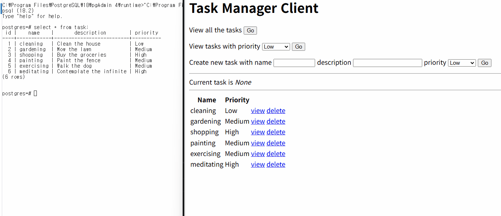

# ktor_ecommerce_project(monorepo)

## ktor-task-app
### Docs study : Handle requests and generate responses (02-15)

## ktor-rest-task-app
### Docs study : Create a RESTful API (02-16)

## ktor-task-web-app
### Docs study : Create a website (02-17)

  

## ktor-websockets-task-app
### Docs Study : Create a Websocket application (02-18)

    

## ktor-exposed-task-app
### Docs Study : Integrate a database (02-18)

    